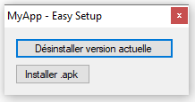

# winforms_apk_easysetup_redistribuable
A WinForms project, very simple, to redistribute an .apk.

**What it does:**

- Install an .apk automatically, click on a button, search for the apk file and the process automatically does everything.
  - It also automatically sets the "Developer Mode" on.
- Delete an application with a specified "package name".

**Steps to redistribute for your own application:**

- Just change the packname like "com.mycompany.myproduct" to yours
- Change the language, icons & texts ;P

**You're welcome!**
